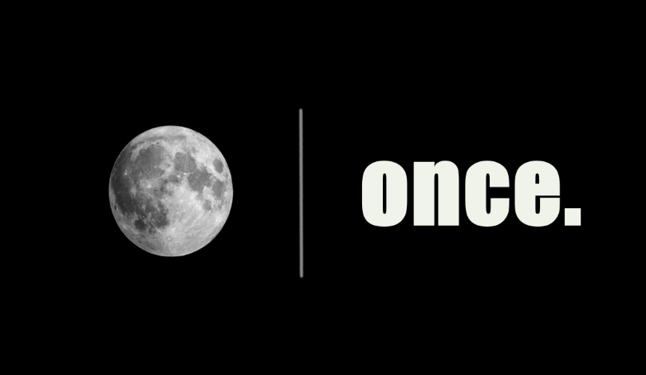

# About
Hello,I am glab about your coming. I am a font developer.Under here have some of my projects.If you have any advice or questions,please
tell me with any method you can. I am wellcome for the advice. 

### Wish you have a good day.

## 📌 Pinned Repositories

 

 
 

## &#x1f4c8; GitHub Stats

## 💼 Skills

## 📣 How about an Office quote before you go?

> I have been Michael's #2 guy for about 5 years. And we make a great team. We're like one of those classic famous teams. He's like Mozart, and I'm like Mozart's friend. No. I'm like Butch Cassidy, and Michael is like Mozart. You try and hurt Mozart; you're going to get a bullet in your head courtesy of Butch Cassidy.
>
> 
- Dwight Schrute

_Quote requested from [The Office API](https://www.officeapi.dev/)_

Check back at the top of the hour for a new quote!
